# 📊 DIAGRAM PROYEK & VISUALISASI
## Sistem Pendaftaran Perlombaan

---

## 1. Diagram Alur Sistem Keseluruhan

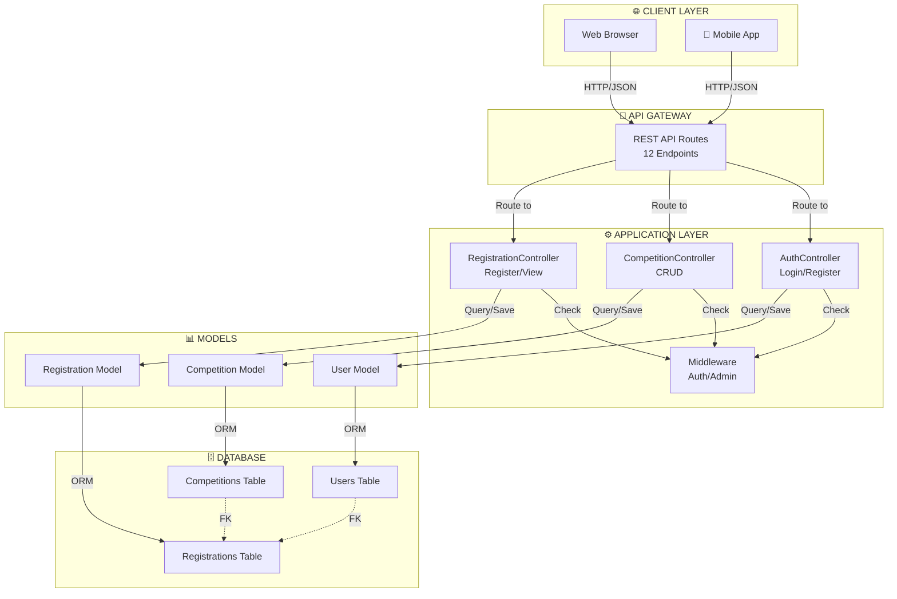

---

## 2. Entity Relationship Diagram (ERD)

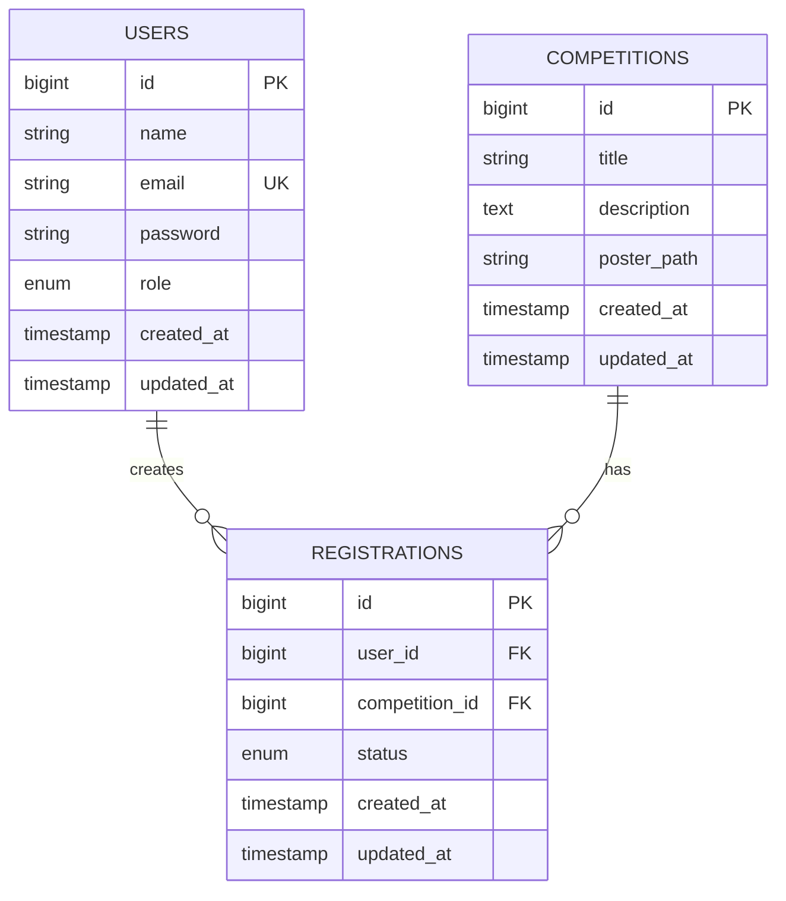

---

## 3. API Request/Response Flow

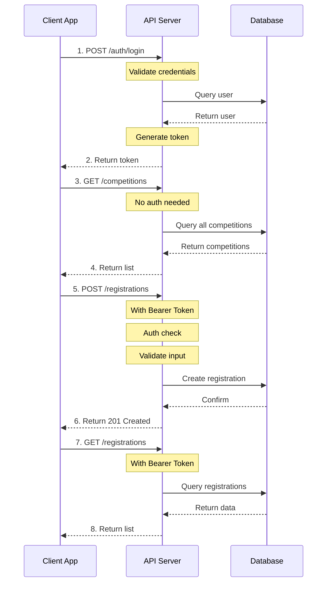

---

## 4. Admin Features Flow

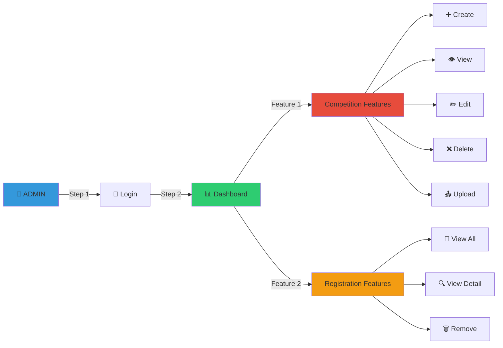

---

## 5. Peserta Features Flow

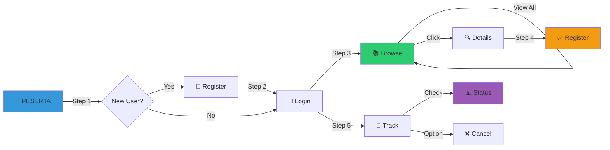

---

## 6. Database Relationships

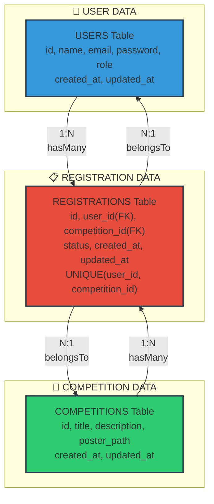

---

## 7. Authentication & Authorization Flow

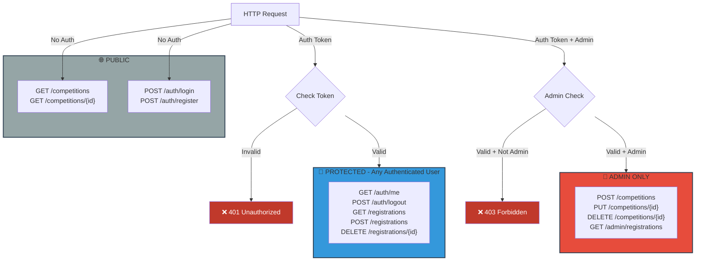

---

## 8. API Endpoints Overview

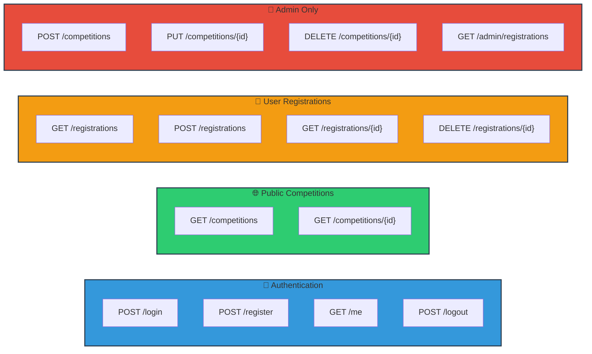

---

## 9. Project Structure Tree

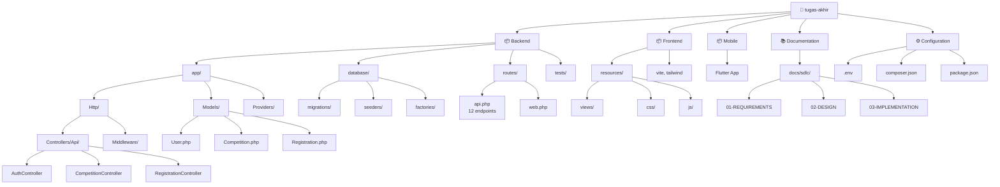

---

## 10. Data Flow: Creating a Competition

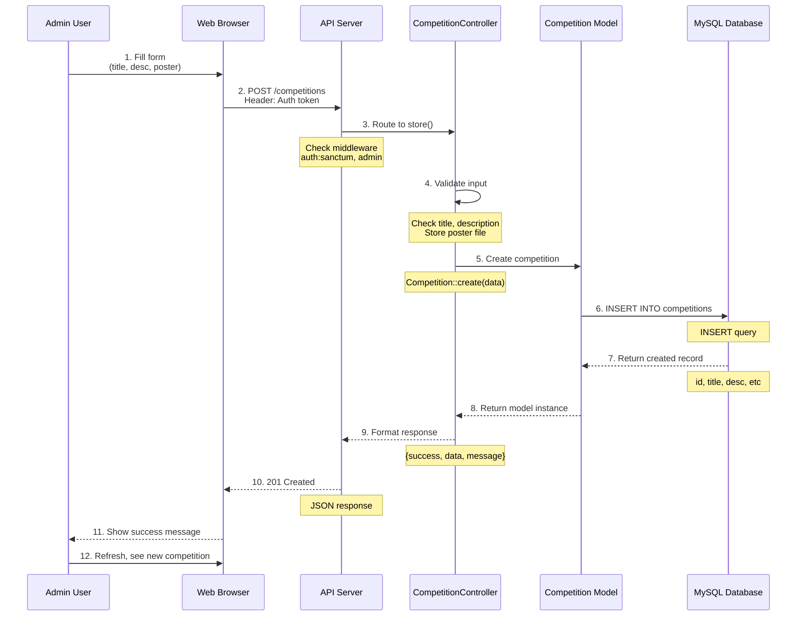

---

## 11. Data Flow: Peserta Registering

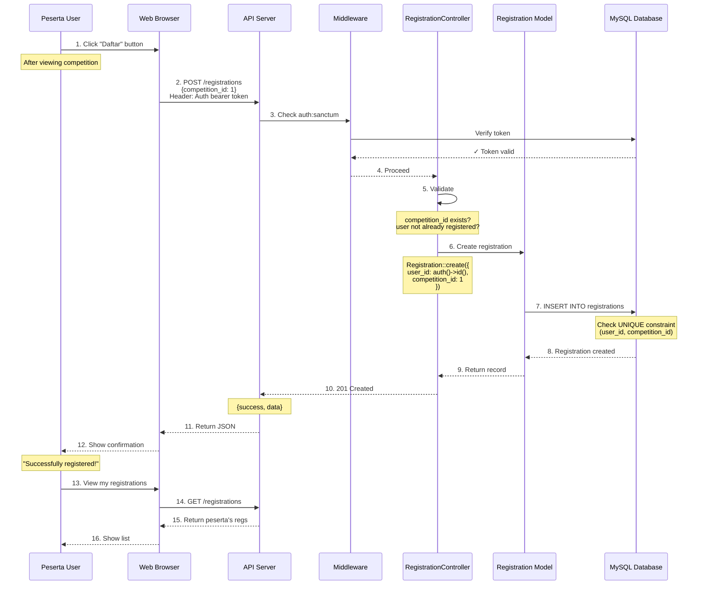

---

## 12. SDLC Process Phases


---

## 13. User Role Matrix

```mermaid
graph TB
    User as User

    User -->|Login| Auth["🔐 Authentication"]
    
    Auth -->|role: admin| Admin["👑 ADMIN"]
    Auth -->|role: peserta| Peserta["👤 PESERTA"]
    
    Admin -->|Can| AC1["✅ Create Competition"]
    Admin -->|Can| AC2["✅ Edit Competition"]
    Admin -->|Can| AC3["✅ Delete Competition"]
    Admin -->|Can| AC4["✅ View All Registrations"]
    Admin -->|Cannot| AC5["❌ Register as Peserta"]
    
    Peserta -->|Can| PC1["✅ Browse Competitions"]
    Peserta -->|Can| PC2["✅ Register to Competition"]
    Peserta -->|Can| PC3["✅ View Own Registrations"]
    Peserta -->|Can| PC4["✅ Cancel Registration"]
    Peserta -->|Cannot| PC5["❌ Create Competitions"]
    Peserta -->|Cannot| PC6["❌ View Others' Registrations"]
    
    style Admin fill:#e74c3c,color:#fff
    style Peserta fill:#3498db,color:#fff
    style Auth fill:#2ecc71,color:#fff
```

---

## 14. Response Format Structure

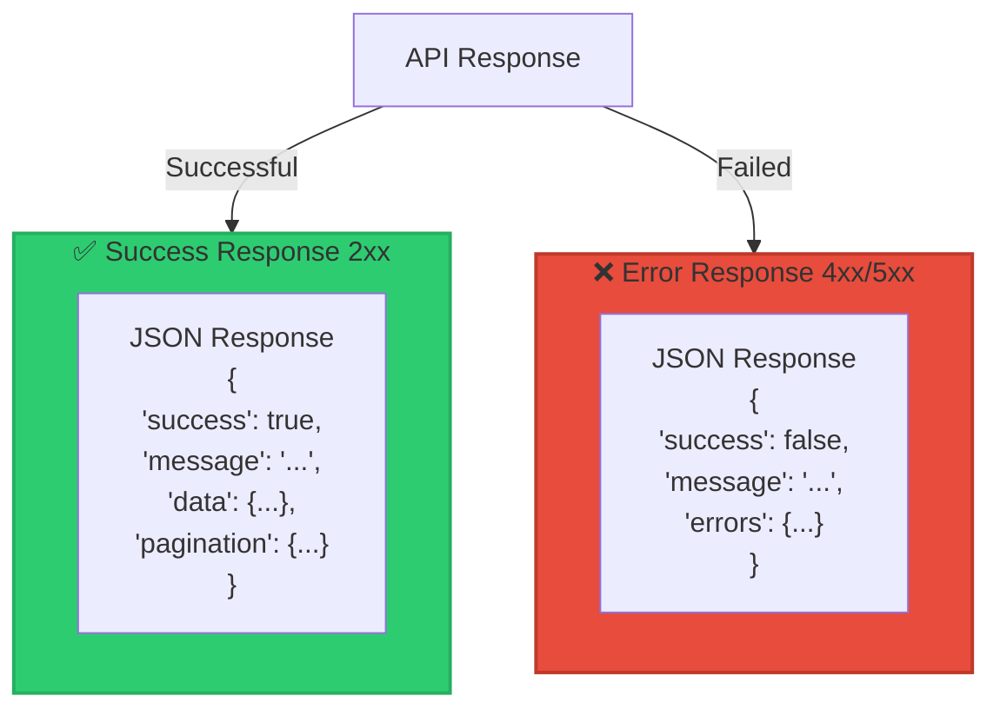

---

## 15. Deployment Architecture

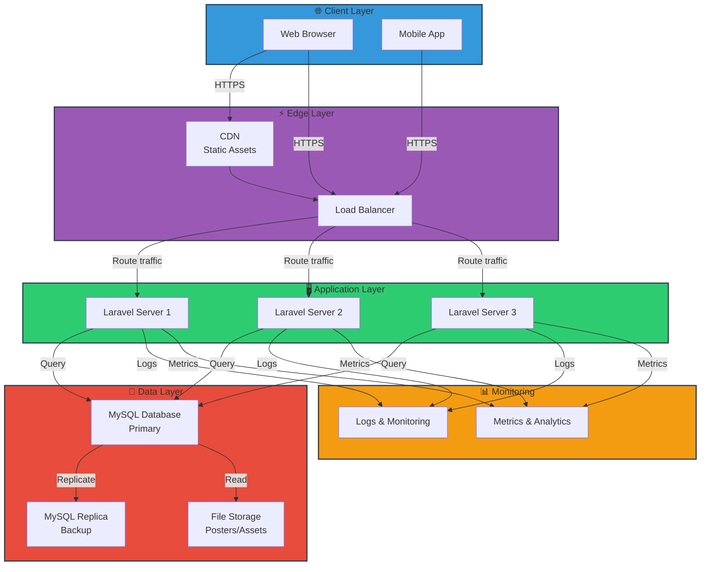

---

**Last Updated:** February 24, 2026  
**Status:** Complete ✅  
**All Diagrams:** Ready for Visualization
