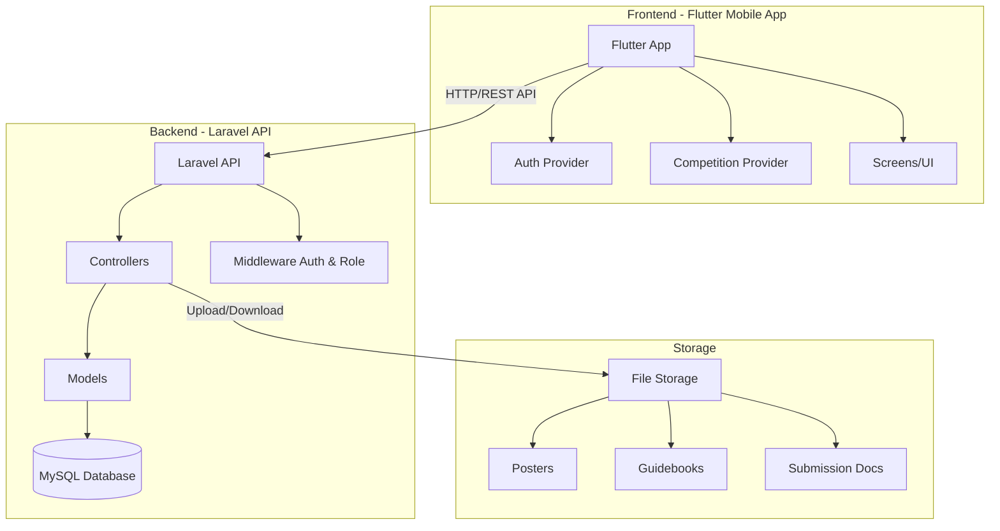
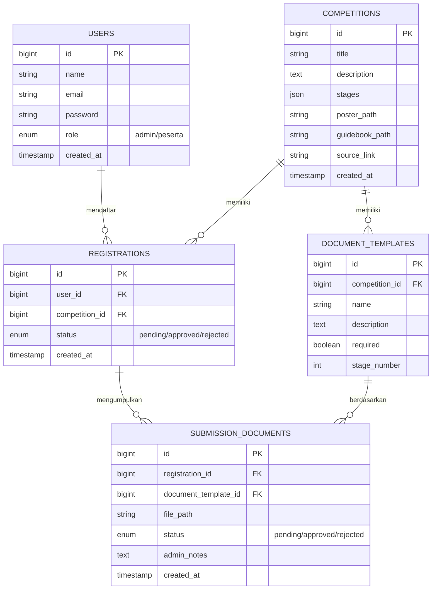
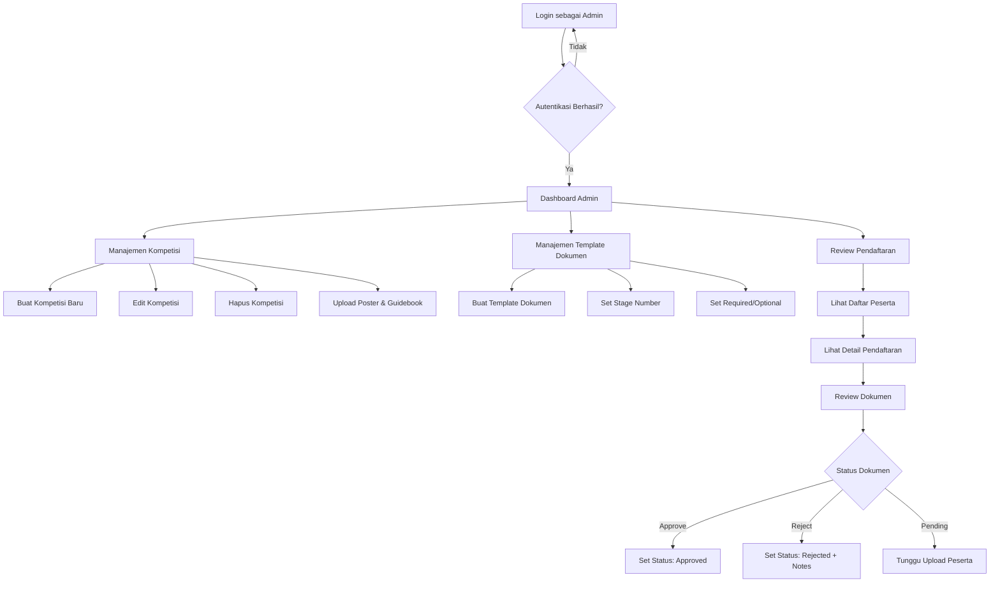
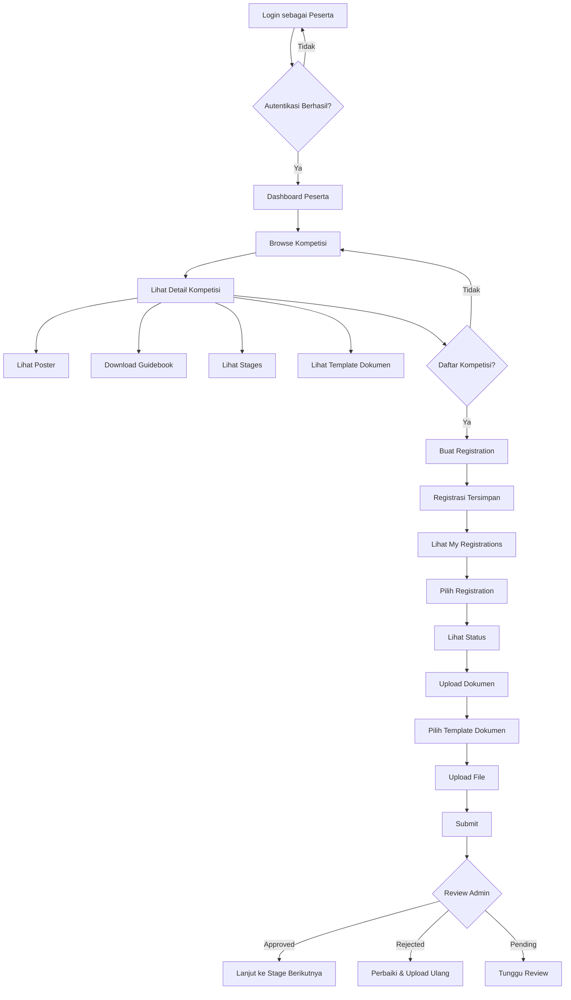
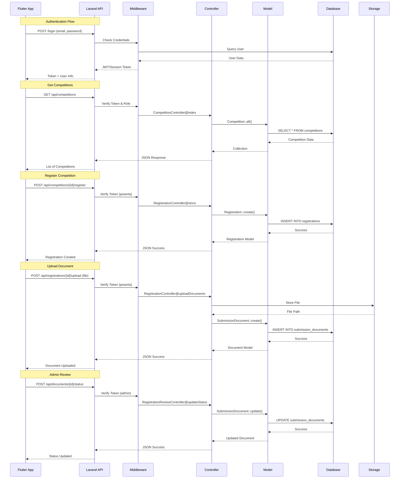
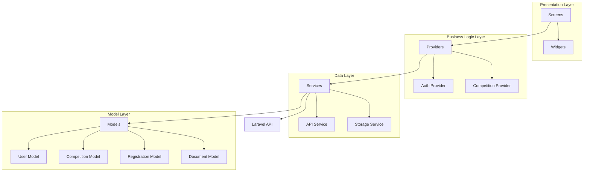
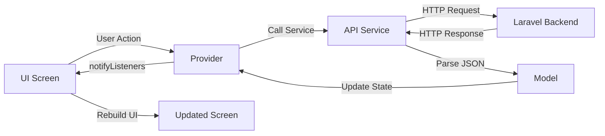
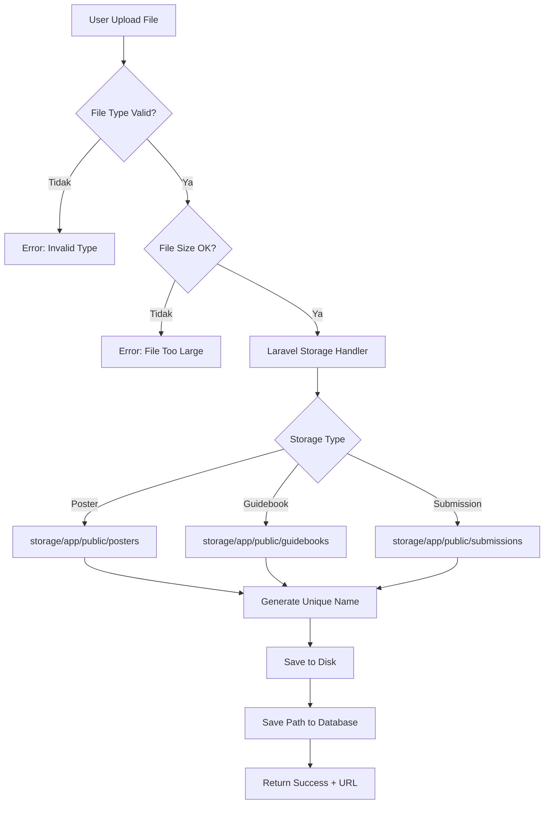
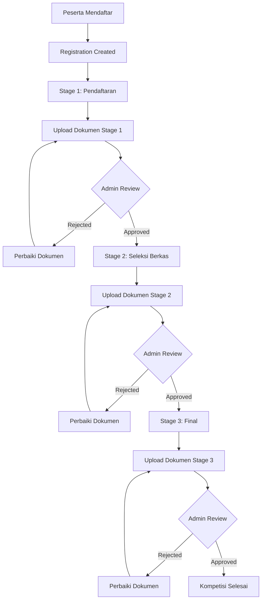
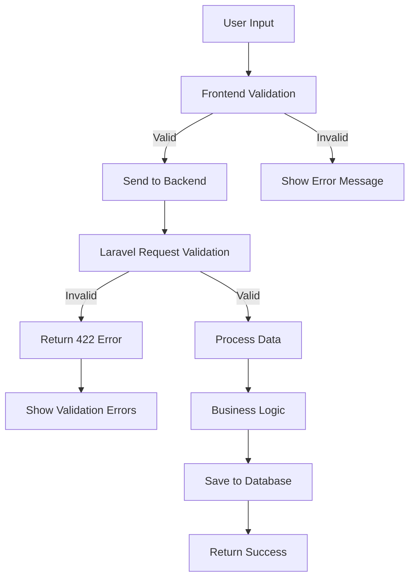

# 📊 Diagram Alur Project Sistem Kompetisi

## 1. Arsitektur Sistem Keseluruhan



## 2. Database Schema & Relasi



## 3. Alur Pengguna (User Flow)

### 3.1 Flow untuk Admin



### 3.2 Flow untuk Peserta



## 4. API Flow (Laravel Backend)



## 5. Flutter App Architecture



## 6. State Management Flow (Flutter)



## 7. Middleware & Authorization Flow

```mermaid
flowchart TD
    A[HTTP Request] --> B{Authenticated?}
    B -->|Tidak| C[Redirect to Login]
    B -->|Ya| D{Check Role}
    
    D -->|admin| E[Admin Routes]
    E --> E1[/admin/competitions]
    E --> E2[/admin/registrations]
    E --> E3[/admin/documents]
    
    D -->|peserta| F[Peserta Routes]
    F --> F1[/peserta/competitions]
    F --> F2[/peserta/registrations]
    F --> F3[/peserta/upload]
    
    D -->|Invalid| G[403 Forbidden]
    
    E1 --> H[Controller Action]
    E2 --> H
    E3 --> H
    F1 --> H
    F2 --> H
    F3 --> H
    
    H --> I[Response]
```

## 8. File Upload & Storage Flow



## 9. Competition Stages Flow



## 10. Data Validation Flow



## Penjelasan Komponen Utama

### Backend (Laravel)
- **Models**: User, Competition, Registration, DocumentTemplate, SubmissionDocument
- **Controllers**: 
  - Admin: Manajemen kompetisi, review pendaftaran
  - Peserta: Browse kompetisi, daftar, upload dokumen
- **Middleware**: Auth (Laravel Sanctum/Session), Role-based access
- **Storage**: File system untuk poster, guidebook, dan submission documents

### Frontend (Flutter)
- **Providers**: State management menggunakan Provider pattern
- **Screens**: UI untuk berbagai fitur (login, home, competitions, etc.)
- **Services**: HTTP client untuk komunikasi dengan Laravel API
- **Models**: Dart classes untuk data models

### Database
- **users**: Data pengguna dengan role (admin/peserta)
- **competitions**: Data kompetisi
- **registrations**: Pendaftaran peserta ke kompetisi
- **document_templates**: Template dokumen yang harus diupload
- **submission_documents**: Dokumen yang diupload peserta

### Alur Utama
1. **Admin** membuat kompetisi dan template dokumen
2. **Peserta** melihat dan mendaftar kompetisi
3. **Peserta** upload dokumen sesuai template
4. **Admin** review dan approve/reject dokumen
5. Proses berlanjut sesuai stages kompetisi
